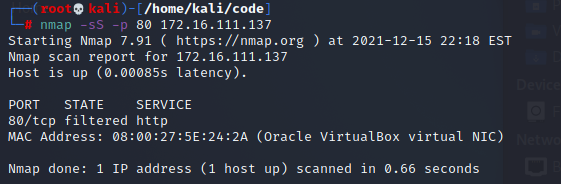

# 实验五：基于 Scapy 编写端口扫描器

## 实验目的

掌握网络扫描之端口状态探测的基本原理

## 实验环境

- python 
- scapy
- nmap
- Linux kali

## 实验要求

- [x] 完成以下扫描技术的编程实现

  - TCP connect scan / TCP stealth scan

  - TCP Xmas scan / TCP fin scan / TCP null scan

  - UDP scan

- [x] 上述每种扫描技术的实现测试均需要测试端口状态为：`开放`、`关闭` 和 `过滤` 状态时的程序执行结果

- [x] 提供每一次扫描测试的抓包结果并分析与课本中的扫描方法原理是否相符？如果不同，试分析原因；

- [x] 在实验报告中详细说明实验网络环境拓扑、被测试 IP 的端口状态是如何模拟的

- [x] （可选）复刻 `nmap` 的上述扫描技术实现的命令行参数开关（每种扫描测试一种状态，且后面专门用nmap进行了扫描实验）

## scapy基础

```python 
# 导入模块
from scapy.all import *
# 查看包信息
pkt = IP(dst="")
ls(pkt)
pkt.show()
summary(pkt)
# 发送数据包
send(pkt)  # 发送第三层数据包，但不会受到返回的结果。
sr(pkt)  # 发送第三层数据包，返回两个结果，分别是接收到响应的数据包和未收到响应的数据包。
sr1(pkt)  # 发送第三层数据包，仅仅返回接收到响应的数据包。
sendp(pkt)  # 发送第二层数据包。
srp(pkt)  # 发送第二层数据包，并等待响应。
srp1(pkt)  # 发送第二层数据包，并返回响应的数据包
# 监听网卡
sniff(iface="wlan1",count=100,filter="tcp")
# 应用：简单的SYN端口扫描 （测试中）
pkt = IP("...")/TCP(dport=[n for n in range(22, 3389)], flags="S")
ans, uans = sr(pkt)
ans.summary() # flag为SA表示开放，RA表示关闭
```

## 实验过程

### 网络拓扑


### 端口状态模拟

- 关闭状态：对应端口没有开启监听, 防火墙没有开启。


```bash
 sudo ufw disable
```

- 开启状态：对应端口开启监听: apache2基于TCP, 在80端口提供服务; DNS服务基于UDP,在53端口提供服务。防火墙处于关闭状态。


```bash
 sudo systemctl start apache2 # port 80

 sudo systemctl start dnsmasq # port 53
```

- 过滤状态：对应端口开启监听, 防火墙开启。


 ```bash
  sudo ufw enable && ufw deny 80/tcp
 
  sudo ufw enable && ufw deny 53/udp
 ```

查看被扫描主机初始状态


### 实验步骤

一下每一个模块三幅图分别展示`攻击者主机运行代码测试的结果`，`靶机抓包的结果`，`攻击者主机使用nmap复刻的结果`

#### TCP connect scan

[code](code/tcp_connect_scan.py)

- Closed

  


- Open

  


- Filtered

  


####  TCP stealth scan

[Code](code/tcp_stealth_scan.py)

- Closed

  


- Open


- filtered


####  TCP Xmas scan

[code](code/tcp_xmas_scan.py)


- closed


- open


- filtered





####  TCP fin scan

[code](code/tcp_fin_scan.py)

- closed


- open


- filtered


#### TCP null scan

[code](code/tcp_null_scan.py)

- closed


- open


- filtered


#### **UDP scan**

[code](code/udp_scan.py)

- closed


- open


- filtered


### 问题

filtered状态下执行nmap显示'…host seems down…'

[解决办法](https://www.cnblogs.com/bravexz/p/10069371.html)


### 参考资料

[课本](https://c4pr1c3.gitee.io/cuc-ns/chap0x05/main.html)

[LyuLumos实验](https://github.com/CUCCS/2020-ns-public-LyuLumos/tree/ch0x05/ch0x05#%E7%AB%AF%E5%8F%A3%E7%8A%B6%E6%80%81%E6%A8%A1%E6%8B%9F)

[Nmap基础](https://www.cnblogs.com/bravexz/p/10069371.html)


